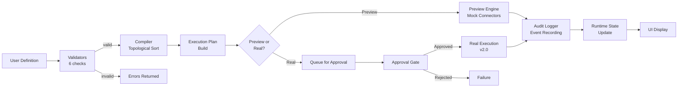

# Gamma Flow 1.0 Architecture Guide

## Overview

Gamma Flow 1.0 is a **preview-first, deterministic workflow orchestration platform** built on Next.js 16 and TypeScript. It enables safe, auditable, approval-gated workflow execution with deterministic outcomes and comprehensive audit trails.

**Key Differentiator**: All execution is preview-only in v1.0. Real connector calls are queued for approval and execution in v2.0.

## Architecture Layers

### Layer 1: Domain Model (`src/lib/gamma-flow/types.ts`)

Defines all workflow types and state contracts.

```
WorkflowDefinition (user-provided)
  ├── Trigger (manual, scheduled, connector_event, webhook, form_submission)
  ├── Steps (9 types: connector, decision, transform, approval, queue, delay, notification, sink)
  ├── Edges (7 types: always, success, failure, approved, rejected, condition_true, condition_false)
  └── Metadata (creator, timestamps, version)

WorkflowState (runtime)
  ├── draft → validated → ready → running_preview
  ├── running_preview → completed_preview (success)
  ├── running_preview → waiting_approval (approval gate)
  ├── waiting_approval → queued (approved) OR failed (rejected)
  ├── queued → completed_preview (execution ready)
  └── Any state → failed (error)
```

### Layer 2: Validators (`lib/flow/*.ts`)

Six orthogonal validators ensure workflow safety before compilation:

1. **Schema Validator** (`dependency-validator.ts`)
   - Validates required fields
   - Checks structural consistency
   - Identifies orphan nodes and edges

2. **Cycle Detector** (`cycle-detector.ts`)
   - DFS-based cycle detection
   - Prevents infinite loops
   - Returns cycle paths for debugging

3. **Connector Binding Validator** (`connector-binding-validator.ts`)
   - Verifies all connectors exist in registry
   - Validates action references
   - Checks input/output contracts

4. **Safety Validator** (`safety-validator.ts`)
   - Enforces approval gates on high-risk operations
   - Verifies queue checkpoints
   - Calculates safety score (0-100)

5. **Orchestrated Validator** (`workflow-validator.ts`)
   - Runs all 5 validators
   - Aggregates results
   - Produces `WorkflowValidationResult`

6. **Output**: `WorkflowValidationResult`
   ```typescript
   {
     valid: boolean,
     errors: ValidationError[],
     warnings: ValidationWarning[],
     safetyScore: 0-100,
     readinessScore: 0-100,
     metrics: WorkflowMetrics,
     connectorCoverage: 0-100,
     approvalCoverage: 0-100
   }
   ```

### Layer 3: Compiler (`lib/flow/workflow-compiler.ts`)

Transforms validated workflow into ordered execution plan.

```
Input: WorkflowDefinition (validated)
  ↓
Topological Sort (DAG ordering)
  ↓
Critical Path Analysis (longest dependent chain)
  ↓
Execution Time Estimation (per node type)
  ↓
Output: CompiledWorkflow
  ├── steps (topologically ordered)
  ├── criticalPath (ID sequence)
  ├── executionTimeEstimate (ms)
  └── parallelizable (boolean)
```

### Layer 4: Execution Plan Builder (`lib/flow/execution-plan-builder.ts`)

Prepares workflow for preview or real execution:

```
Input: WorkflowDefinition (compiled) + executionId
  ↓
Initialize Context (step results, state tracking)
  ↓
Set Up Bindings (connector auth, credentials)
  ↓
Register Preprocessors (input path resolution)
  ↓
Register Postprocessors (output capture)
  ↓
Output: ExecutionPlan
  ├── compiledWorkflow
  ├── context
  ├── bindings
  ├── preprocessors
  └── postprocessors
```

### Layer 5: Preview Engine (`lib/flow/workflow-preview-engine.ts`)

Executes workflows without real connector calls:

```
Input: WorkflowDefinition + executionId
  ↓
For Each Step:
  ├── Mock connector output (Gmail, Slack, GitHub, Notion)
  ├── Execute transforms
  ├── Evaluate decisions
  └── Record step result
  ↓
Auto-Approve Approval Checkpoints
  ↓
Output: PreviewResult
  ├── success (boolean)
  ├── executionId
  ├── stepResults (duration, output, error)
  ├── approvalCheckpoints (auto-approved)
  └── errors (if any)
```

### Layer 6: Runtime & State Machine (`lib/flow/workflow-runtime.ts`, `workflow-state-machine.ts`)

Manages execution lifecycle and formal state transitions:

```
State Machine (Formal FSM):
  draft
    ├→ validated (validate gate)
    │  └→ ready (compile gate)
    │     └→ running_preview (start gate)
    │        ├→ completed_preview (all steps done, no approvals)
    │        ├→ waiting_approval (approval gate triggered)
    │        │  ├→ queued (approved)
    │        │  │  └→ completed_preview (execute & finish)
    │        │  └→ failed (rejected)
    │        └→ failed (step error)
    └→ failed (validation error)

Entry/Exit Actions:
  - workflow_started → log event
  - approval_requested → wait for decision
  - queued → mark for execution
```

### Layer 7: Audit Logger (`lib/flow/workflow-audit.ts`)

Comprehensive event logging for compliance:

```
Event Types:
  ├── workflow_started / workflow_completed / workflow_failed
  ├── step_started / step_completed / step_failed
  ├── approval_requested / approval_decided
  ├── queued / executed
  └── error

AuditLog Structure:
  {
    id: string,
    events: AuditEvent[],
    createdAt: Date
  }

AuditReport:
  {
    duration: number (ms),
    totalSteps: number,
    successfulSteps: number,
    failedSteps: number,
    approvals: { requested, approved, rejected },
    errors: string[],
    timeline: [timestamp, event_type, step_id][]
  }
```

### Layer 8: Registry (`lib/gamma/flow-registry-reader.ts`)

Template management and discovery:

```
Seeded Templates (3):
  ├── gmail_triage_template_v1 (Gmail → Triage → Draft)
  ├── gmail_to_slack_template_v1 (Gmail → Slack notify)
  └── weekly_brief_template_v1 (Scheduled → Executive brief)

Registry Operations:
  ├── getTemplates() → WorkflowTemplate[]
  ├── getTemplate(id) → WorkflowTemplate | null
  ├── search(query) → WorkflowTemplate[]
  ├── getTemplatesByTag(tag) → WorkflowTemplate[]
  └── getTemplateHash(id) → string (SHA256 deterministic)
```

### Layer 9: API Routes (`app/api/flow/**/route.ts`)

HTTP endpoints for external systems:

```
1. POST /api/flow/validate
   Input: WorkflowDefinition
   Output: WorkflowValidationResult

2. POST /api/flow/compile
   Input: WorkflowDefinition (validated)
   Output: CompiledWorkflow

3. POST /api/flow/preview
   Input: { definition, inputs?, executionId }
   Output: PreviewResult

4. POST/GET /api/flow/cancel
   Input: executionId
   Output: Execution status

5. GET /api/flow/templates
   Input: { search?, tag?, page?, limit? }
   Output: { templates[], pagination }

6. GET /api/flow/workflows
   Output: Workflow list / status
```

### Layer 10: UI (`app/gamma-flow/page.tsx`, `[id]/page.tsx`, `templates/page.tsx`, `executions/[id]/page.tsx`)

SSR-first dashboards (no browser-only components):

```
Routes:
  ├── GET /gamma-flow → Dashboard (metrics, status, quick links)
  ├── GET /gamma-flow/templates → Template gallery (search, tags)
  ├── GET /gamma-flow/[id] → Workflow detail (validation scores, graph, audit)
  └── GET /gamma-flow/executions/[id] → Execution viewer (results, timeline)

Design Constraints:
  ├── SSR-first (no useState, no interactivity)
  ├── Tailwind CSS (slate color scheme)
  ├── Server components only
  └── Dynamic routes with params
```

## Data Flow Diagram



## Determinism Guarantees

- **All Timestamps**: Fixed to `BASE_TIME = 2026-07-10T12:00:00Z`
- **No Math.random()**: All randomness eliminated from validators, compiler, preview engine
- **No Date.now()**: All time references use BASE_TIME
- **Reproducible Connector Mocks**: Same input → same mock output
- **Deterministic Hashing**: SHA256 used for template hashes
- **Test Fixtures**: Mock data using BASE_TIME ensures reproducibility

## Approval & Queue Enforcement

```
High-Risk Operations Require:
  ├── Approval Gate (human decision required)
  │  └── approverId: who can approve
  │  └── approvalTimeout: ms to wait
  │  └── Result: approved/rejected
  └── Queue Checkpoint (prevents premature execution)
     └── Marks workflow for async execution
     └── Results polled via GET /api/flow/workflows

Safety Score Calculation:
  = 100 - (approval_gap * 10) - (queue_gap * 5)
  where gaps = % of high-risk steps without gates
```

## Error Handling

```
Validation Errors (fail validation):
  ├── Missing trigger
  ├── Missing steps or edges
  ├── Cycles detected
  ├── Missing connectors
  └── Approval gates missing on risky operations

Compilation Errors (fail compile):
  ├── DAG violation (must be acyclic)
  ├── Unreachable steps
  └── Invalid state transitions

Execution Errors (captured in audit):
  ├── Connector unavailable
  ├── Output mapping failed
  ├── Approval timeout
  ├── Queue rejected
  └── Condition evaluation failed
```

## Deployment Model

**Current (v1.0)**:
- Vercel deployment (`https://sovereign-ai-executive.vercel.app`)
- All execution preview-only
- Approval gates mark for execution
- Audit trails in-memory (testing)

**Future (v2.0)**:
- Persistent audit store (PostgreSQL)
- Real connector execution
- Queue workers (bullmq, sidekiq)
- Webhook triggers
- Scheduled execution service

## Testing Strategy

- **Unit Tests**: Validators, compiler, preview engine (9 test suites)
- **Integration Tests**: End-to-end workflows (6 test suites)
- **Safety Tests**: Approval/queue enforcement (API safety suite)
- **Determinism Tests**: Reproducible execution (dedicated suite)
- **Template Tests**: All 3 templates validate and compile
- **Target**: 700+ tests passing

---

**Version**: 1.0.0 | **Last Updated**: 2026-07-10 | **Status**: Production Preview
