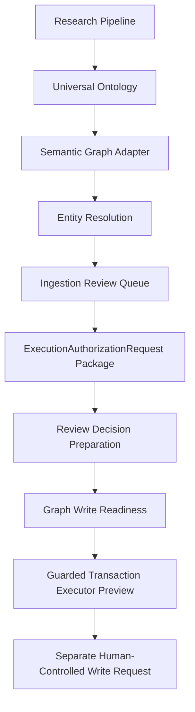

# EV-KOS Phase 4E Slice 3 - Review Decision Pipeline and Graph Readiness

## Status

Implemented as a read-only decision and readiness layer. This phase connects the
approval pipeline end to end without allowing automatic graph writes.

## Lifecycle

The final manual gate is not executed by this phase. It remains subject to the
existing guarded transaction executor gates.

## Approval States

Review decisions support:

- `APPROVE_CREATE`
- `APPROVE_MATCH`
- `APPROVE_MERGE`
- `REJECT`
- `REQUEST_MORE_INFORMATION`

Approval decisions only prepare graph write readiness. They do not create,
update, merge, delete, or approve graph data automatically.

## Decision Flow

1. `IngestionReviewQueueItem` identifies the reason for review.
2. A persisted `ExecutionAuthorizationRequest` package provides traceability.
3. `buildReviewDecision()` prepares the reviewer disposition.
4. `validateReviewDecision()` checks actor, tenant, package, and target context.
5. `prepareGraphWriteDecision()` determines whether the decision can move to
   readiness evaluation.
6. `evaluateGraphWriteReadiness()` verifies all gates before any separate
   transaction request can be considered.

## Duplicate Handling

`POSSIBLE_DUPLICATE` items remain unresolved until a reviewer prepares one of:

- `APPROVE_CREATE` to accept a new entity candidate
- `APPROVE_MATCH` to bind the candidate to an existing entity
- `REQUEST_MORE_INFORMATION` to defer
- `REJECT` to stop the candidate

`APPROVE_MERGE` is preparation-only until merge semantics are implemented.

## Conflict Handling

`BLOCK_CONFLICT` items should not become graph write candidates. The readiness
check marks entity resolution as `BLOCKED` if blocked conflicts remain.

## Tenant Validation

The readiness checklist requires:

- `actorId`
- `organizationId`
- `workspaceId`

This does not replace the existing transaction executor tenant validation. It
only ensures the context is present before a future guarded request.

## Risk Scoring

Risk remains layered:

- governed ingestion risk score
- duplicate risk from entity resolution
- review item priority and risk level
- transaction executor validation

High-risk or blocked governance states cannot move to readiness.

## Audit Flow

This phase expects traceability from:

- governed ingestion audit output
- persisted `ExecutionAuthorizationRequest` package id
- prepared review decision evidence
- future guarded transaction audit records

No new audit database writes are added in this phase.

## Future Write Flow

A future write flow must still pass:

- governance `ALLOW` or `ALLOW_WITH_WARNING`
- `approvalRequired: false`
- duplicate and conflict resolution
- persisted review package traceability
- actor, organization, and workspace scope
- transaction executor validation
- explicit operator action

The current executor still defaults to dry-run and keeps the
`explicit-test-write` boundary.

## Routes

- `GET /api/ontology/review-decision`
- `POST /api/ontology/review-decision`
- `GET /api/ontology/graph-write-readiness`
- `GET /api/ontology/system-readiness`

All routes return `graphWrites: false`.

## Non-Goals

This phase does not:

- write graph records
- update graph records
- delete graph records
- approve automatically
- publish automatically
- weaken governance or tenant checks
- change Prisma schema
- create migrations
