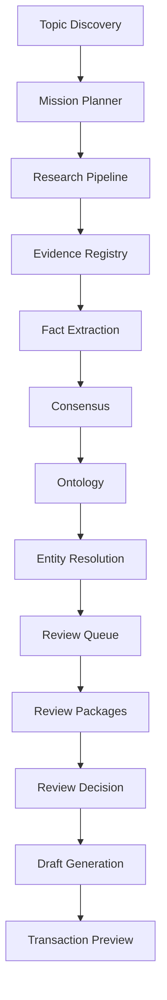

# EV-KOS Phase 5 - Autonomous Research Mission Engine

## Status

Phase 5 foundation is implemented as a dry-run orchestration layer. It plans and
coordinates autonomous research missions without bypassing governance,
approval, graph-write, or publication gates.

## Mission

The Autonomous Research Mission Engine coordinates:

The engine does not execute the downstream systems automatically in this slice.
It prepares mission plans, readiness reports, dashboards, and validated state
transitions.

## Files

- `lib/research/mission-state-machine.ts`
- `lib/research/topic-discovery.ts`
- `lib/research/research-prioritization.ts`
- `lib/research/mission-planner.ts`
- `lib/research/mission-engine.ts`
- `app/api/research/missions/route.ts`
- `app/api/research/missions/discover/route.ts`
- `app/api/research/missions/readiness/route.ts`

## Lifecycle States

The state machine covers:

- `DISCOVERED`
- `PLANNED`
- `RESEARCHING`
- `COLLECTING`
- `VERIFYING`
- `EXTRACTING`
- `CONSENSUS`
- `ONTOLOGY`
- `ENTITY_RESOLUTION`
- `REVIEW_READY`
- `APPROVED`
- `DRAFT_READY`
- `COMPLETED`
- `FAILED`
- `BLOCKED`

Transitions are validated by `validateMissionTransition()`. Approval and
completion states include warnings that they do not imply automatic approval,
publication, or graph writes.

## Topic Discovery Scoring

Topic candidates are scored by:

- existing knowledge gaps
- freshness
- category diversity
- strategic priority
- manual requests
- trending capability placeholder
- duplicate avoidance

Live trend collection is intentionally disabled in this phase.

## Mission Readiness

Mission readiness evaluates:

- Research
- Evidence
- Verification
- Ontology
- Entity Resolution
- Review Queue
- Approval
- Draft Generation

Readiness returns an overall score from `0` to `100`, along with `READY`,
`PARTIAL`, or `BLOCKED` status.

## Dashboard

The dashboard returns:

- active missions
- queued missions
- blocked missions
- completed missions
- failure reasons
- readiness
- estimated next action

Mock data is acceptable in this phase and is used by the read-only routes.

## Governance Boundary

The mission engine returns:

- `writesToPrisma: false`
- `graphWrites: false`
- `graphDeletes: false`
- `automaticApprovals: false`
- `automaticPublishing: false`

It does not:

- change Prisma schema
- create migrations
- write graph records
- delete graph records
- approve review packages
- publish content
- weaken transaction gates
- weaken tenant validation

## Future Integration

Later phases can connect the mission plan to real execution one step at a time:

1. Persist missions with tenant-aware ownership.
2. Execute source collection under explicit operator approval.
3. Persist mission audit events.
4. Generate review packages from mission outputs.
5. Prepare drafts for human editorial review.
6. Keep graph writes behind the guarded transaction executor.

## Phase 6 Readiness

Phase 6 should focus on multi-format publishing only after mission outputs are:

- source-grounded
- verified
- consensus-grouped
- mapped into ontology
- reviewed by humans
- blocked from automatic publication by default
