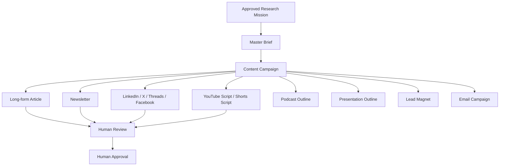

# EV-KOS Phase 6 - Creator Content Orchestration Engine

## Status

Phase 6 foundation is implemented as a read-only orchestration framework. It
converts an approved research mission into a governed multi-channel campaign
plan without generating, publishing, posting, approving, or writing graph data.

## Mission

The Creator Content Orchestration Engine coordinates:



Publication and social posting are not part of this phase.

## Core Modules

- `lib/content/content-campaign.ts`
- `lib/content/content-brief.ts`
- `lib/content/channel-planner.ts`
- `lib/content/content-lineage.ts`
- `lib/content/content-readiness.ts`
- `lib/content/content-orchestrator.ts`

## Routes

- `GET /api/content/orchestrator`
- `POST /api/content/orchestrator`
- `GET /api/content/campaigns`
- `GET /api/content/readiness`

All routes return planning or readiness data only.

## Campaign Model

Each campaign contains:

- research mission
- master brief
- long-form article
- newsletter
- LinkedIn
- X / Twitter
- Threads
- Facebook
- YouTube script
- Shorts script
- podcast outline
- presentation outline
- lead magnet
- email campaign

Every asset includes:

- `id`
- `type`
- `parentMission`
- `campaignId`
- `lineage`
- `reviewStatus`
- `approvalStatus`
- `readiness`
- `publicationState`
- `citations`
- `version`

## Master Brief

The master brief is the canonical source for all downstream assets. It captures:

- topic
- audience
- purpose
- key findings
- verified claims
- citations
- tone
- CTA
- keywords
- risks

No content generation happens in this phase.

## Channel Planner

The channel planner describes:

- which assets should exist
- recommended creation order
- dependencies
- estimated effort
- review gates

It returns:

- `generationAllowed: false`
- `publicationAllowed: false`
- `socialPostingAllowed: false`

## Lineage

Every asset is traceable through:

```text
Research Mission
-> Evidence
-> Consensus
-> Ontology
-> Review Package
-> Master Brief
-> Generated Asset
```

Lineage validation requires at least:

- research mission id
- evidence ids
- review package ids

Consensus and ontology ids are recommended and included in the example flow.

## Readiness

Readiness is returned for:

- Article
- Newsletter
- Social
- Video
- Podcast
- Lead Magnet
- Email
- Campaign

Overall campaign readiness is scored from `0` to `100`.

## Dashboard

The dashboard reports:

- campaign summary
- asset counts
- missing assets
- pending review
- pending approval
- ready for generation
- ready for publication

`readyForPublication` remains `0` because Phase 6 does not publish or approve.

## Hard Boundaries

This phase does not:

- change Prisma schema
- create migrations
- write graph data
- delete graph data
- publish content
- post to social channels
- approve content automatically
- weaken governance

## Phase 6B Recommendation

Phase 6B should add draft-generation preparation only:

1. Require a reviewed master brief.
2. Prepare prompt/input contracts for each asset type.
3. Keep generated drafts in memory or preview response only unless a separate
   persistence slice is approved.
4. Keep publication and social posting blocked.
