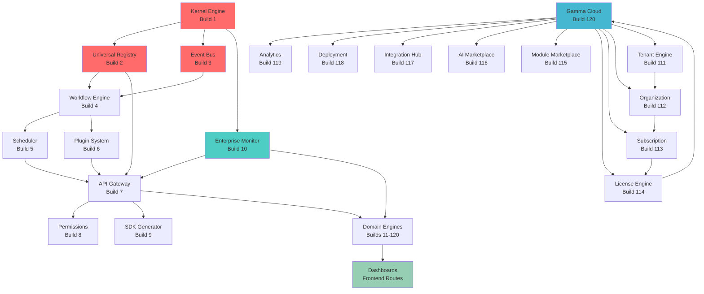

# Gamma Dependency Graph

**Baseline:** gamma-build-120-frozen  
**Last Updated:** 2026-07-08  

---

## System Dependency Overview



---

## Layered Dependency Model

### Layer 0: Core Runtime
```
Kernel (Build 1)
├── Registry (Build 2)
├── Event Bus (Build 3)
├── Workflow Engine (Build 4)
└── Enterprise Monitor (Build 10)
```

### Layer 1: Infrastructure
```
Scheduler (Build 5)
├── Kernel
├── Event Bus
└── Workflow

Plugin System (Build 6)
├── Registry
└── Kernel

API Gateway (Build 7)
├── Registry
├── Event Bus
├── Kernel
└── Permissions

Permissions (Build 8)
├── Registry
└── Kernel
```

### Layer 2: Development Tools
```
SDK Generator (Build 9)
├── Registry
├── API Gateway
└── Kernel
```

### Layer 3: Domain Engines (Builds 11–120)
```
Each domain engine:
├── Types (TypeScript definitions)
├── Mock Data (Deterministic registry)
├── Reader (Async loader)
└── Dashboard Routes (SSR pages)

Dependencies:
├── → Kernel (registration)
├── → Registry (discovery)
├── → Event Bus (optional: publish events)
├── → Enterprise Monitor (health reporting)
└── → API Gateway (optional: expose routes)
```

### Layer 4: Platform Features (Builds 111–120)
```
Tenant Engine (111)
├── Organization Engine (112)
│   ├── Subscription Engine (113)
│   │   ├── License Engine (114)
│   │   └── Module Marketplace (115)
│   └── Permissions
├── AI Marketplace (116)
├── Integration Hub (117)
├── Deployment Engine (118)
├── Analytics Engine (119)
└── Gamma Cloud (120)
```

### Layer 5: Dashboards
```
All 120 domain routes:
├── /[domain]           → Main dashboard
├── /[domain]/[id]      → Detail page
└── /api/[domain]/...   → API endpoints (optional)

Executive routes:
├── /api/executive/...  → Leadership dashboards
└── /admin/...          → Operations dashboards
```

---

## Cross-Domain Dependencies

### Mission Control Dependencies

Mission Control is imported by:
- Governance reader (mission alignment)
- Portfolio reader (mission tracking)
- Strategy reader (mission roadmap)
- Execution reader (mission progress)
- Agent Registry reader (mission assignment)
- Ecosystem reader (mission integration)
- Workflow reader (mission orchestration)
- Intelligence Core reader (mission insights)
- Nexus reader (mission coordination)

**Pattern:** Mission Control provides the central planning hub that other domains coordinate through.

---

## Registry Pattern Dependencies

Every reader depends on:
1. Domain's `mock-data.ts` (deterministic assets)
2. Domain's `types.ts` (TypeScript validation)
3. Gamma Kernel (registration)
4. Implicit: Enterprise Monitor (discovery)

---

## Event Bus Publisher Pattern

Domains that publish events:
- Workflow Engine → triggers on execution
- Scheduler → publishes on task completion
- Plugin System → publishes on plugin load
- Event Bus → publishes events
- All workflows → publish status updates

All events are synthetic (mock) and deterministic.

---

## API Gateway Route Mapping

```
API Gateway (Build 7) routes requests to:
├── /api/health              → Health check (public)
├── /api/gamma/*             → API Gateway routes
├── /api/executive/*         → Executive dashboards
├── /admin/*                 → Admin dashboards
└── /[domain]/*              → Domain routes

Each route maps to:
├── Reader from lib/gamma/
├── Permissions check
├── Response transformation
└── HTTP response
```

---

## Enterprise Monitor Integration

Enterprise Monitor (Build 10) automatically discovers:
- All 120 domain engines
- System metrics (CPU, memory, latency)
- Health scores from each reader
- Aggregate system health
- Alert conditions

**No manual registration required** — discovery is automatic via kernel registry.

---

## Gamma Cloud Master Dashboard

Gamma Cloud (Build 120) aggregates:

```
Gamma Cloud (120)
├── Tenant Registry (111)
│   └── Organizations (112)
│       ├── Users
│       ├── Deployments (118)
│       ├── Licenses (114)
│       ├── Subscriptions (113)
│       ├── Modules (115)
│       └── AI Agents (116)
├── Integrations (117)
├── Analytics (119)
└── Regional Status
    ├── Docker (local)
    ├── Railway
    ├── Vercel
    ├── Azure
    ├── AWS
    ├── GCP
    └── DigitalOcean
```

No circular dependencies — all flow upward to Gamma Cloud.

---

## Determinism & Timestamp Dependency

All domain readers depend on:
```
const FIXED_TIMESTAMP = 1751990400000  // 2026-07-08 00:00:00 UTC
```

This ensures:
- All mock data reproducible
- All test results deterministic
- All builds comparable
- Time-based logic testable

---

## Smoke Test Dependency Chain

```
npm run smoke:v1
├── GET /api/health
│   └── Public health check
├── GET /api/executive/health
│   └── Kernel + Enterprise Monitor
├── GET /api/executive/*                (9 executive routes)
│   └── Mission Control + Readers
├── GET /admin/*                        (12 admin routes)
│   └── Kernel + Readers
└── All return HTTP 200 (success)

Total: 22 verified routes
```

---

## Build Dependency Order

To build safely:

1. **Core Infrastructure** (Builds 1–10): Kernel, Registry, Event Bus, Monitor
2. **Tools** (Builds 11–20): API Gateway, Scheduler, Plugin System
3. **Domain Engines** (Builds 21–120): All specialized domains

Each layer assumes lower layers are complete.

---

## Breaking Changes Detection

A change in:
- **Kernel or Registry** → affects all 120 domains
- **Event Bus** → affects workflow-dependent domains
- **API Gateway** → affects all routes
- **Enterprise Monitor** → affects health discovery
- **A domain** → affects only that domain and its dependents

**Current Status:** Zero breaking changes across full history.

---

## Future Dependencies (Phase XIV+)

### Planned in Phase XIV
- Real-time WebSocket connections (Event Bus extensions)
- Advanced query engine (Registry extensions)
- ML-based recommendations (Analytics extensions)
- Multi-region failover (Deployment extensions)

### Planned in Phase XV
- Blockchain audit log (Kernel extensions)
- Advanced permissions (Permissions extensions)
- External integrations (Integration Hub extensions)
- Real-time collaboration (Workflow extensions)

---

## Verification

✅ No circular dependencies  
✅ All 120 builds integrated without conflicts  
✅ Clear layered architecture  
✅ All dependencies documented  
✅ Enterprise Monitor auto-discovery working  
✅ API Gateway routing correct  
✅ Smoke tests validate full dependency chain  
