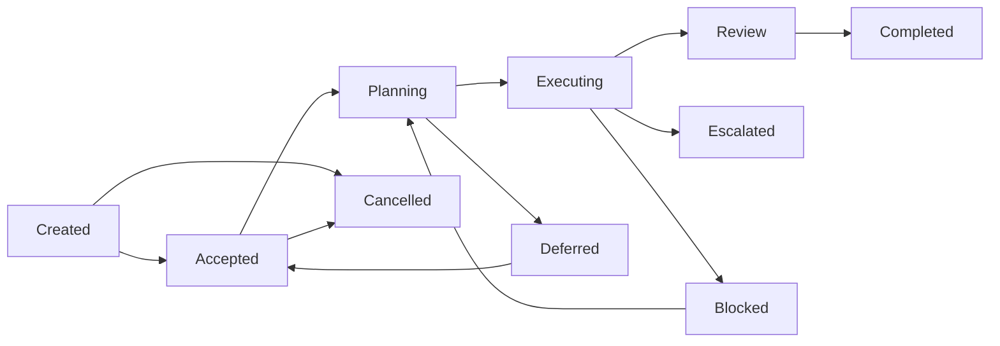

# Workstream D — Task Lifecycle

## Objective

Every task follows a governed lifecycle with defined transitions, audit trail, and clear responsibility boundaries.

## Lifecycle



## Task Model

```yaml
Task:
  taskId: "task-101"
  type: "research-collection"
  summary: "Collect user sentiment data for Q3"
  assignedTo: "RO-001"
  assignedBy: "PM-003"
  status: "executing"        # One of 10 valid statuses
  priority: 3
  dependencies: [ "task-100" ]
  humanApprovalRequired: false
  created: 1710400000000
  accepted: 1710400500000
  completed: null
  auditTrail:
    - action: "created"
      agentId: "PM-003"
      timestamp: 1710400000000
      detail: "Collect user sentiment data for Q3"
    - action: "accepted"
      agentId: "RO-001"
      timestamp: 1710400500000
      detail: ""
```

## Valid Status Transitions

| From | To |
|---|---|
| created | accepted, cancelled |
| accepted | planning, cancelled |
| planning | executing, deferred |
| executing | review, escalated, blocked |
| review | completed, executing |
| blocked | planning |
| escalated | executing, review |
| deferred | accepted |
| Any | cancelled |

## Governance Policies

| Policy | Rule | Enforcement |
|---|---|---|
| WFT-001 | Task status transitions must follow the valid lifecycle map | Platform status validation |
| WFT-002 | Every status change is recorded in the audit trail | Platform audit enforcement |
| WFT-003 | Tasks requiring human approval cannot reach completed without approval gate | Gamma OS Governance Gate |
| WFT-004 | Blocked tasks auto-escalate after 24 hours | Platform escalation trigger |
